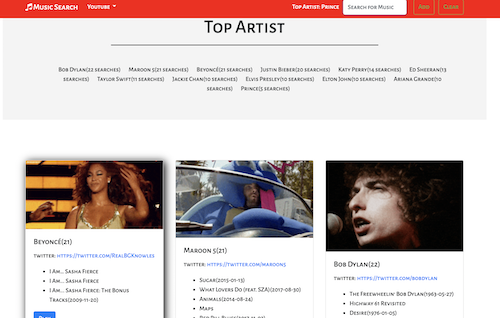
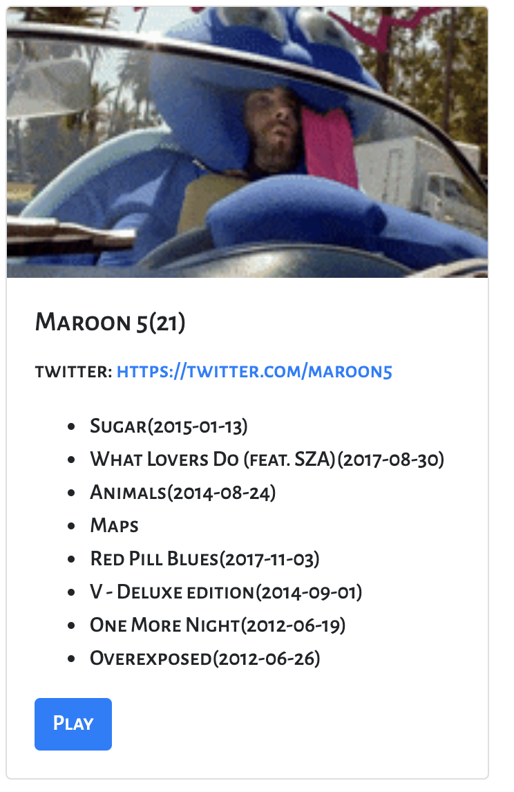

# _*MusicSearch*_
### *by Team JFK*

One of the simple joys in life for many people is the experience of getting into a new band or composer. Everybody remembers the first time they heard that special album by their favorite group, and had to know more - what else have these guys recorded? What do they look like? Are there any videos of them? And most critically, are they on Twitter?!

Team JFK's *MusicSearch* aggregates the most commonly sought after data on musicians in one convenient page. Moreover, MusicSearch records and ranks your searches, so information on your top artists is always on hand.

Don't get lost in the sea of up and coming musicians on the scene today - MusicSearch is your lighthouse! 

## How does this program work ?
1. This is an aggregation site which search through SoundCloud API for user entered a musician. The program would check the rating of the artist. It would require 50+% rating to be considered as a valid artist.
2. The program would display the most popular albums, the artist's twitter account, the picture (from Giphy API) and the most popular YouTube video (from Google YouTube API) on the musician's "card". 
3. The program would keep the popularity of each artist in the firebase database. The popularity is based on the global searches and the top 12 artists' "card" would be displayed when the program starts as defaults.

[Click Here to run the _MusicSearch_ Program](https://jasonjpeng.github.io/MusicSearch/)

*Future features:
Spotify and Soundcloud API support
Wikipedia bios
Friends lists*

----

### coding challenges
> This program invokes a "chain" API calls to different websites. We have to carefully arrange the callback functions because we cannot expect a timely return from each API call.   

----
The program starts with the top 12 most searched artists

Each searched artist is shown in a "card" with picture, twitter account, albums and a click to the post popular YouTube video 

